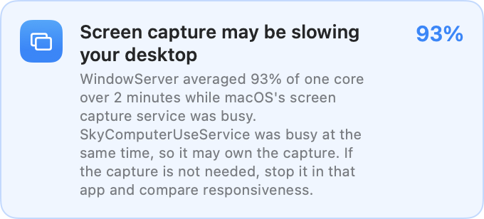

# Display capture load

Input and cursor movement can feel slow while total CPU, memory pressure, and
swap look normal. Screen capture can add work to WindowServer, the macOS display
service, and replayd. A large Mac can have spare CPU capacity while its display
service is busy with most of one core.

Native card preview with synthetic readings, not a recording of user activity.

Insights shows **Screen capture may be slowing your desktop** when existing
process readings meet all of these conditions:

- WindowServer uses at least 70% of one CPU core.
- replayd uses at least 1% of one core.
- Their activity overlaps for at least 80% of a two-minute window, with each
  process's time-weighted mean also meeting its threshold.

replayd is the service behind ScreenCaptureKit, which almost every current
capture tool uses: screen sharing in Teams and Zoom, OBS, Loom, CleanShot,
QuickTime recording, and AI agents that watch the screen. WindowServer and
replayd staying busy together is therefore the signal that something is
capturing the screen and costing the display service, whoever owns the stream.
replayd's floor is low on purpose: on the maintainer's Mac it averaged 0.16%
of a core over a week and passed 1% in under 3% of minutes. During one
morning with no OpenAI helper running, while Teams, `screencapture` and screen
sharing processes were present, it held 1% to 2% for runs of several minutes
with WindowServer at 70% to 86%, which this rule reports.

When a recognized capture helper is busy (at least 5% of one core) over the
same window by the same rules, the card names it as the likely owner. The
current recognized helper is OpenAI's `SkyComputerUseService`, including its
truncated kernel name when the executable path resolves the full name, or
bundle identifier `com.openai.sky.CUAService`; Computer Use, Computer History
and app context can share it. Otherwise the card says that something is
capturing the screen and points to the purple screen recording icon in the
menu bar, which shows which apps are capturing. The monitor cannot identify
the owning feature or tell whether the capture is needed.

This is an advisory about correlated activity. It does not measure missed
frames, input latency, or capture-stream ownership, and does not prove a bug.
The suggested comparison is to stop unneeded capture in the owning app and
check whether responsiveness and WindowServer load improve. The monitor does
not stop capture, terminate helpers, or change permissions.

## Evidence and missing data

Each process needs at least three distinct timestamps and coverage of the
two-minute window. No reading is carried across a gap longer than 90 seconds.
The current live snapshot must also be no more than 90 seconds old. A single
spike, an idle helper, disjoint bursts, or missing display-service readings do
not produce this advisory. A restarted process cannot inherit evidence from
an older instance with the same PID.

The detector checks current process activity before reading history. When
capture ends or display load settles, the advisory disappears on the next
Insights refresh instead of continuing from historical averages.

Full Coverage is needed to read WindowServer on configurations where direct
process reads cannot inspect system-owned services. Recorded process history
is also required. Missing coverage leaves this check unknown; silence is not
proof that capture has no cost.

## Monitoring cost and delivery

The rule runs when the existing Insights bundle refreshes. It adds no timer,
process scan, screen recording, accessibility query, or network access. When
WindowServer and replayd both qualify in the live scan, it reads at most five
process histories (those two plus up to three busy recognized helpers) over
210 seconds on the existing read queue. Otherwise it asks for no history.
The short histories reuse the Insights cache cadence.

This card is an Insights diagnostic, not a new background notification or an
automatic watchdog. The underlying capture lifecycle and efficiency still
belong to the application that owns the capture stream.

The headless detector's tests cover the observed high-display-load pattern
with and without a recognized helper, idle or unrecognized helpers, sparse and
missing data, non-overlapping activity, brief spikes, recovery, PID reuse,
invalid samples, and bounded history reads.
